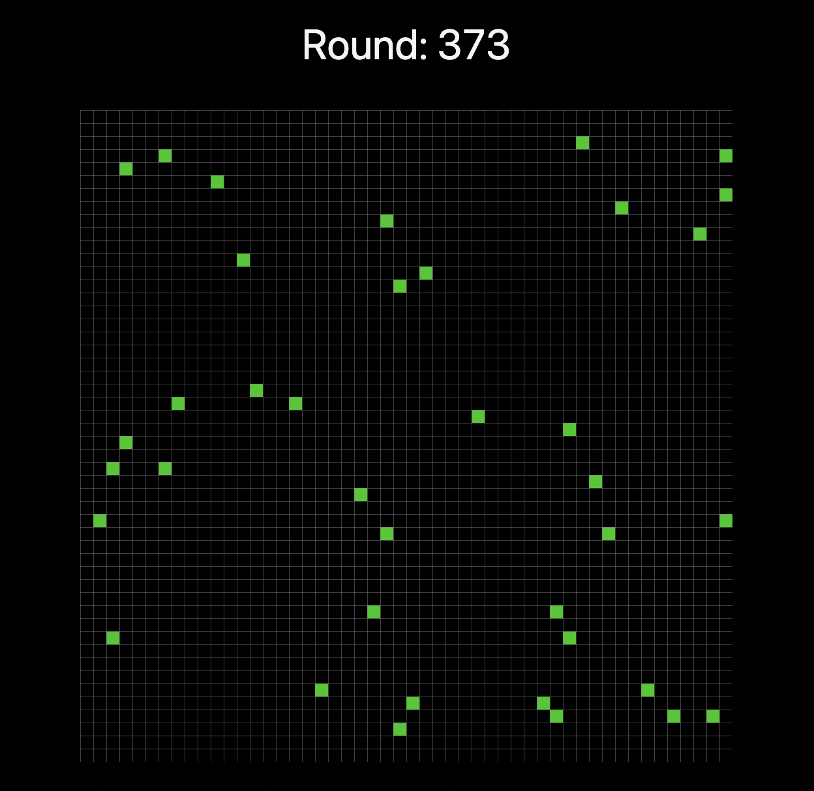
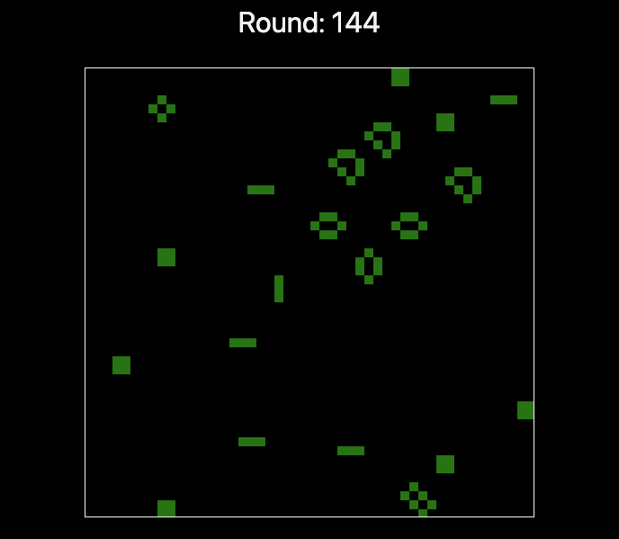

## TODO:

- ~~RECORD GIF FOR CURRENT VERSION - THE GAME IS RENDERING VERY FAST MAKING IT SEEM LIKE THE CELL IS TELEPORTING~~
- ~~TIDY UP DOCS FORMATATION - WROTE THIS IN A HURRY AND NOW ITS MESSY BUT READABLE~~

# Game of life

Based on [Conway's game of life](https://en.wikipedia.org/wiki/Conway%27s_Game_of_Life)

Making this for fun

# Recent Updates:

(WIP) August 12th 2022:

Only a single cell so far and it's going crazy inside a useEffect function that is making it re-render very fast. So visually it's like the cell is blinking on the board and teleporting everywhere. I have to find a way to record a gif for this later but at this point it's not a bug anymore, it's a featureTM

(WIP) August 7th 2022:

(WIP) September 23rd 2022:

Finally had some time to work on this app and want to finish it soon but let's see :laughing:

Now generating the initial board with a fixed value for the initial cells displayed on the board. Next steps are to dinamically get this initial cell value dinamically through user input (might as well make it for the board size too, with some restrictions) and then finish the logic for the cells state of being alive/dead based on the game rules

April 14th 2023:

The game is (finally) finished. I don't know if that can be said for anything and I could implement a lot more stuff on it but it's working 100% and will call it finished just for the sake of finishing the project ;P

Running the project:

- First, clone the repository with `git clone git@github.com:melipefelgaco/conways-game-of-life.git`
- Navigate into the project's root directory then run `yarn install`
- Run development server on your machine with `yarn dev`
